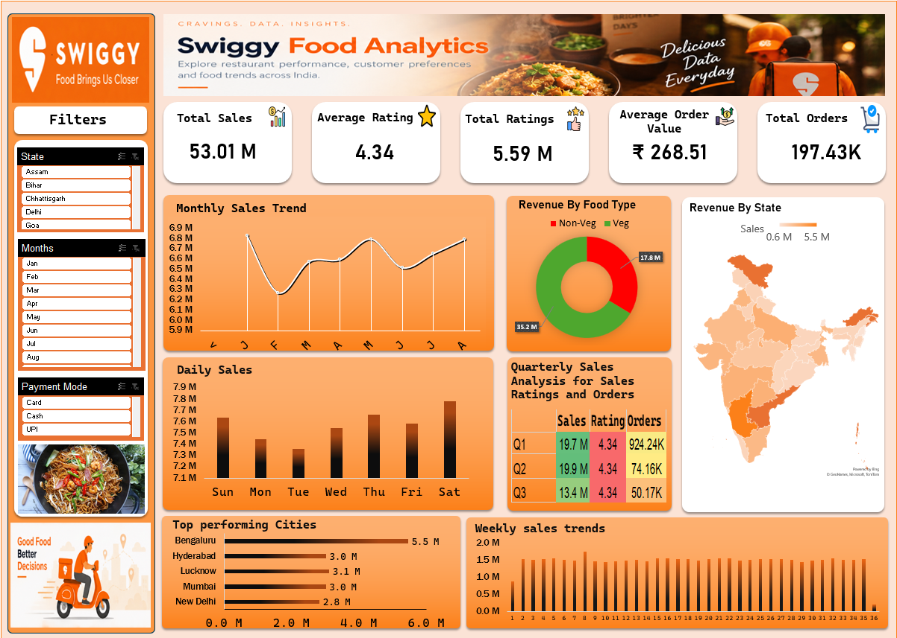

# 🍊 Swiggy Food Analytics Dashboard

An interactive Excel data analytics dashboard built to explore food ordering trends, sales performance, customer preferences, ratings, and geographical performance.

> This is a personal data analytics project created for learning and portfolio purposes. It is not affiliated with or endorsed by Swiggy.

---

## 📊 Dashboard Preview



---

## 🔗 Interactive Dashboard

Explore the dashboard here:

[Open Swiggy Food Analytics Dashboard](https://docs.google.com/spreadsheets/d/1SYMGb4aT2qyNoE9gcNxJ1plKgEONhPW7/edit?usp=sharing&ouid=110829063271858689400&rtpof=true&sd=true)

---

## 🎯 Project Objective

The objective of this project was to transform raw food-ordering data into an interactive and visually understandable dashboard.

The dashboard was designed to answer questions such as:

- How much total revenue was generated?
- How many orders were recorded?
- What is the average order value?
- How do sales change over time?
- Which cities generate the highest sales?
- How does revenue differ between Veg and Non-Veg food?
- How do ratings perform across the dataset?
- Which payment methods are being used?

---

## 📌 Key KPIs

| KPI | Value |
|---|---:|
| Total Sales | ₹53.01M |
| Total Orders | 197.43K |
| Average Order Value | ₹268.51 |
| Average Rating | 4.34 |
| Total Ratings | 5.59M |

---

## 📈 Dashboard Features

The dashboard contains several interactive visualizations and analytical components:

- Monthly Sales Trend
- Weekly Sales Trend
- Daily Sales Analysis
- Quarterly Sales Analysis
- Revenue by Food Type
- Revenue by State
- Top Performing Cities
- Average Rating Analysis
- Total Ratings Analysis
- Interactive State Filter
- Interactive Month Filter
- Interactive Payment Mode Filter

---

## 🗂️ Dataset

The dataset contains food-ordering information across multiple cities and states.

### Main Columns

| Column | Description |
|---|---|
| State | State where the order was recorded |
| City | City associated with the order |
| Order Date | Date of the order |
| Restaurant Name | Restaurant associated with the order |
| Location | Restaurant/order location |
| Category | Food category |
| Dish Name | Name of the dish |
| Price (INR) | Price of the dish |
| Rating | Customer rating |
| Rating Count | Number of ratings |
| Payment Mode | Method of payment |

An additional **Food Type** field was derived to classify dishes as Veg or Non-Veg for analysis.

---

## 🛠️ Tools & Skills Used

- Microsoft Excel
- Data Cleaning
- PivotTables
- PivotCharts
- Excel Slicers
- Calculated Metrics
- KPI Development
- Data Visualization
- Dashboard Design
- Exploratory Data Analysis

---

## 🔄 Project Workflow

Raw Dataset  
↓  
Data Cleaning & Preparation  
↓  
Data Transformation  
↓  
PivotTables & Calculations  
↓  
Data Visualization  
↓  
Interactive Dashboard  
↓  
Business Insights

---

## 💡 Key Learnings

Through this project, I practiced converting a raw dataset into an interactive analytical dashboard.

The project helped strengthen my understanding of:

- Structuring data for analysis
- Selecting meaningful KPIs
- Creating PivotTable-based analysis
- Building interactive filters using slicers
- Choosing appropriate visualizations
- Designing dashboards for readability
- Converting raw data into meaningful insights

---

## 📁 Repository Structure

```text
swiggy-food-analytics-dashboard/
│
├── README.md
├── Swiggy_Food_Analytics_Dashboard.xlsx
├── dashboard-preview.png
│
└── data/
    └── swiggy_data.csv
